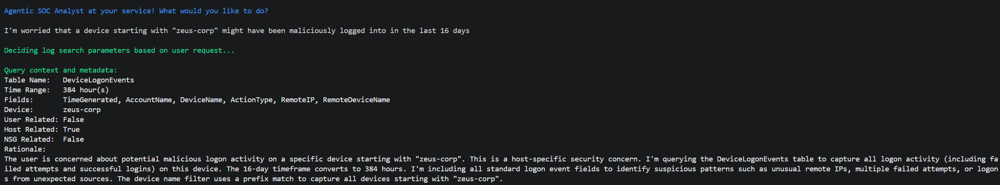
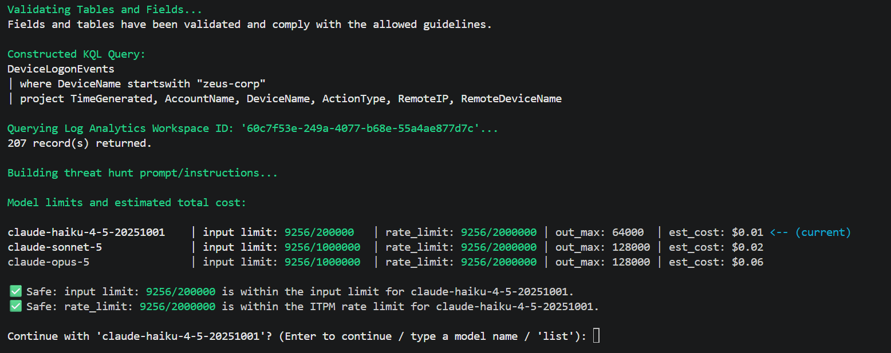
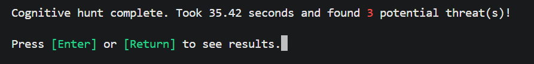
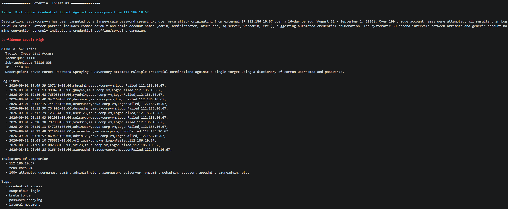
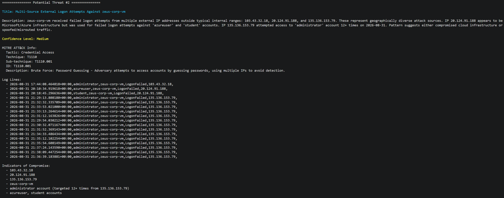
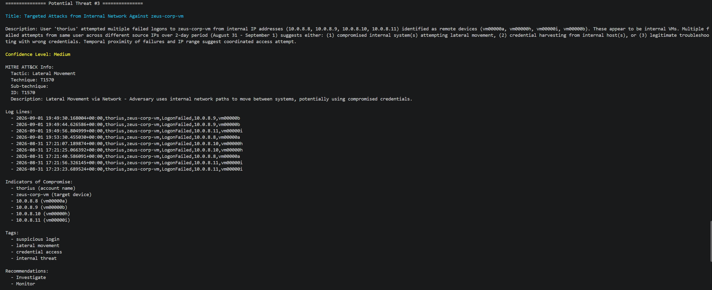
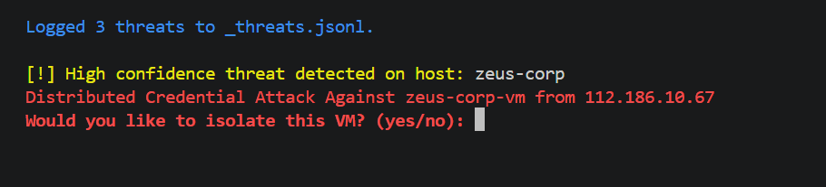

# Agentic-Threat-Hunting-Tool

A Python-based SOC assistant that uses the Claude API to automate the investigation of security incidents — from a plain-English request to a structured, MITRE-mapped threat report.

How It Works
1. Analyst describes what they're worried about — in plain English (e.g. "check for suspicious sign-ins from this user in the last day"), no need to know table names or query syntax.
2. Claude interprets the request — using tool-calling, it decides which log source is relevant (sign-ins, process events, network activity, etc.), the right time range, and the specific fields needed, along with its reasoning for each choice.
3. Logs are retrieved automatically — the tool queries Azure Log Analytics (Microsoft Defender/Sentinel data) using the parameters Claude selected, and only from an allow-listed set of tables and fields for safety.
4. Cost and rate-limit guardrails run before anything expensive happens — the tool estimates token usage and dollar cost across available models, checks it against usage limits, and asks for confirmation before proceeding.
5. Claude analyzes the retrieved logs — again using forced tool-calling (not just a hopeful prompt), it returns a structured JSON report: title, description, MITRE ATT&CK tactic/technique mapping, confidence level, indicators of compromise, tags, and recommended next steps (investigate, monitor, escalate, or ignore).
6. Findings are displayed and logged — results print to the console in a readable format and are appended to a local JSONL file for record-keeping.

This mirrors the orchestration, automation, and response pattern of SOAR platforms (like Cortex XSOAR or Tines), applied specifically to log-based threat hunting.

Tech Stack
- Language: Python
- AI: Anthropic Claude API (tool-calling / structured outputs)
- Data Source: Azure Log Analytics (Microsoft Defender for Endpoint, Microsoft Sentinel)
- Query Language: KQL (Kusto Query Language)
- Auth: Azure Identity (DefaultAzureCredential)
- Other: python-dotenv (secrets management), pandas (log data handling), colorama (CLI output)

---
<h3>Prompt</h3>

---
<h3>Model Choice and Pricing</h3>

---
<h3>Number of Threats</h3>

---
<h3>Threat Analysis</h3>

---

---

---
<h3>Isolation</h3>

